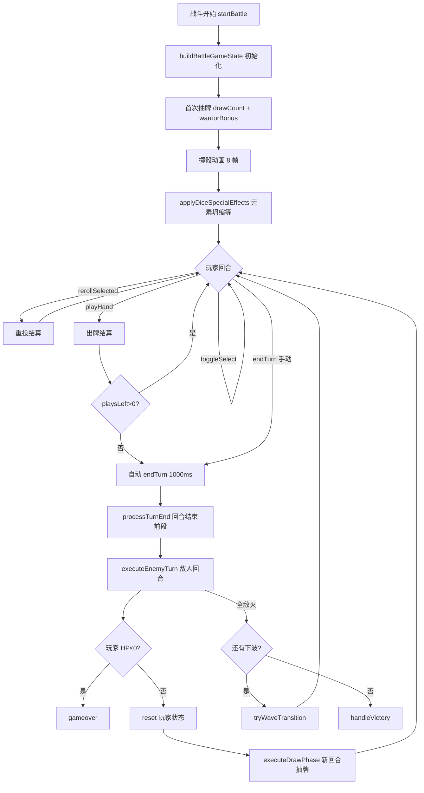
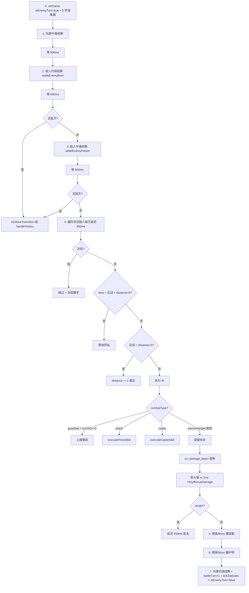

# Dice Hero · Godot 复刻设计规范 v1.0

> **目标**：Godot 版 1:1 还原 React 版 `F:\UGit\dicehero2` 的全部游戏行为。
> **范围**：游戏逻辑 100% + 交互 100% + 动画时序 100%；美术呈现暂缓（但保留原有形式说明，供后续补齐）。
> **读者**：Godot Coder + 测试工程师，看完即可实现。
> **来源**：Coder 两轮考古留痕 + 源码直读（`F:\UGit\dicehero2\src`），每条规则均带文件名证据。
>
> **写作铁律**：
> - 所有数据精确到原数值；不杜撰；不"圆话"。
> - 发现原料/源码冲突 → `[CONFLICT]` 标注。
> - 发现原料缺失 → `[GAP]` 标注，交给 Verify。

---

## 目录

1. 顶层架构与状态机
2. 地图与探索
3. 三职业完整规格
4. 回合骨架总流程
5. 抽牌阶段
6. 出牌阶段
7. 重投阶段
8. 回合结束
9. 敌人回合完整流程
10. 敌人大全（20 普通 / 10 精英 / 10 Boss）
11. 骰子大全
12. 牌型 17 种
13. 遗物大全（85+）
14. 状态效果
15. 洞察弱点挑战系统
16. 商店 / 营火 / 事件 / 宝箱
17. 灵魂晶经济
18. UI 交互规则
19. 美术呈现原有形式（待 Godot 补齐）
20. 存档与边界情况
21. 附录：移植对照 Checklist

---

## 1. 顶层架构与状态机

### 1.1 全局游戏阶段（`GameState.phase`）

```
menu → classSelect → (map ↔ battle ↔ diceReward/loot/shop/campfire/event/treasure/skillSelect)
                         ↓ (Boss + chapter<5)
                    chapterTransition → map (新章节)
                         ↓ (Boss + chapter=5)
                    victory
                         ↓ (hp<=0)
                    gameover
```

### 1.2 完整阶段列表

| phase | 触发 | 职责 |
|---|---|---|
| `menu` | 游戏启动 | 主菜单 |
| `classSelect` | 点开始 | 三职业选择 + 开局遗物 3 选 1 |
| `map` | 职业选完 / 节点结算后 | 地图选择下一节点 |
| `battle` | 踩到 enemy / elite / boss 节点 | 战斗 |
| `diceReward` | 一般战胜利 | 新骰子 3 选 1（含刷新机制） |
| `loot` | 精英/Boss 胜利 | 战利品 + 挑战宝箱 |
| `shop` | 踩到 merchant 节点 | 商店（3 物品 + 骰子净化）|
| `campfire` | 踩到 campfire 节点 | 休息 +40HP / 强化遗物 |
| `event` | 踩到 event 节点 | 10 种随机事件之一 |
| `treasure` | 踩到 treasure 节点 | 免费遗物 3 选 1 |
| `skillSelect` | 特定事件 | 增幅模块选择（以 HP/maxHp 换强化） |
| `chapterTransition` | 章节 Boss 被击败且 chapter<5 | 章节切换动画（回血 60% + 75 金） |
| `gameover` | HP≤0 且无沙漏 | 失败结算 |
| `victory` | 第 5 章最终 Boss 击败 | 通关结算 |

### 1.3 证据

- `DiceHeroGame.tsx` → phase 切换调度
- `hooks/useBattleLifecycle.ts` → startBattle
- `logic/lootHandler.ts resolvePostVictoryPhase()` → 胜利后分支
- `logic/enemyWaveTransition.ts tryWaveTransition()` → 波次

---

## 2. 地图与探索

### 2.1 15 层结构（来源：`config/balance/world.ts MAP_CONFIG`）

| 层 | 类型 | 节点数 | 说明 |
|---|---|---|---|
| 0 | enemy（固定） | 1 | 教学战 |
| 1 | - | 3 | 初期分路 |
| 2 | - | 5 | 扩散层 |
| 3 | - | 3 | 风险层（可出精英）|
| 4 | - | 4 | 中期分叉 |
| 5 | - | 5 | 扩散层 |
| 6 | - | 4 | Boss 前分散（保证带营火）|
| **7** | **boss（固定）** | 1 | **中期 Boss** |
| 8 | - | 3 | Boss 后分路 |
| 9 | - | 5 | 扩散层 |
| 10 | - | 5 | 中后期风险 |
| 11 | - | 4 | 后期分散 |
| 12 | - | 5 | 压力层 |
| 13 | - | 4 | Boss 前分散（保证带营火）|
| **14** | **boss（固定）** | 1 | **最终 Boss** |

### 2.2 节点类型概率（非固定层 fallback）

```
elite     10%
campfire  12%
treasure  10%
merchant  12% × 2 = 24%（加权）
event     10%
enemy     ~34%（剩余）
```

### 2.3 章节切换规则（`config/balance/world.ts CHAPTER_CONFIG`）

| 字段 | 值 |
|---|---|
| 总章节数 | 5 |
| 章节名 | 幽暗森林 / 冰封山脉 / 熔岩深渊 / 暗影要塞 / 永恒之巅 |
| 章节通关恢复 HP | `maxHp × 0.6` |
| 章节通关奖励金 | 75 |

### 2.4 章节累积缩放

| 章 | hpMult | dmgMult |
|---|---|---|
| 1 | 1.00 | 1.00 |
| 2 | 1.25 | 1.15 |
| 3 | 1.55 | 1.30 |
| 4 | 1.90 | 1.50 |
| 5 | 2.30 | 1.70 |

### 2.5 深度缩放（15 层系数表，`config/balance/player.ts DEPTH_SCALING`）

| depth | hpMult | dmgMult | 节奏 |
|---|---|---|---|
| 0 | 0.90 | 0.40 | 教学 |
| 1 | 1.10 | 0.50 | |
| 2 | 1.25 | 0.60 | |
| 3 | 1.50 | 0.75 | 精英层 |
| 4 | 1.20 | 0.65 | 缓冲 |
| 5 | 1.40 | 0.80 | |
| 6 | 1.20 | 0.70 | Boss 前 |
| 7 | 1.80 | 1.00 | **中 Boss** |
| 8 | 1.10 | 0.60 | 缓冲 |
| 9 | 1.40 | 0.80 | |
| 10 | 1.60 | 0.90 | |
| 11 | 1.80 | 1.00 | |
| 12 | 2.00 | 1.10 | pre-boss |
| 13 | 1.30 | 0.80 | 缓冲 |
| 14 | **2.50** | **1.30** | **终 Boss** |

### 2.6 敌人最终数值公式

```
enemy.hp = floor(baseHp × depthHpMult × chapterHpMult × nodeMultiplier)
enemy.dmg = floor(baseDmg × depthDmgMult × chapterDmgMult × nodeMultiplier)
```

其中 `nodeMultiplier`：
- boss 第 1 波小兵 = 0.6 hp / 0.7 dmg
- elite 跟班 = 0.5 hp / 0.6 dmg
- 普通战第 2 波 = 0.8 × 第 1 波

---

## 3. 三职业完整规格

### 3.1 初始属性表（`data/classes.ts`）

| 字段 | 战士 warrior | 法师 mage | 盗贼 rogue |
|---|---|---|---|
| hp / maxHp | **120** | 100 | 90 |
| drawCount | 3 | 3 | 3 |
| maxPlays（出牌/回合）| 1 | 1 | **2** |
| freeRerolls（免费重投/回合）| 1 | 1 | 1 |
| canBloodReroll | **true** | false | false |
| 初始骰子 | std×4 + w_bloodthirst + w_ironwall | std×4 + mage_elemental + mage_reverse | std×3 + r_quickdraw + r_combomastery |
| 通用上限 | maxDrawCount=6, 初始遗物槽=5, souls=0 | 同左 | 同左 |

### 3.2 战士专属机制

1. **血怒补牌**（被动 passive）：HP ≤ 50%×maxHp 时，每回合抽牌数 +1
   - 触发点：`drawPhase.ts` + `useBattleLifecycle.rollAllDice`
   - 效果：`warriorBonus = 1` 纳入 `targetHandSize`

2. **血怒叠层**（触发 on_reroll）：每次**卖血**重投（非免费）
   - `bloodRerollCount += 1`，上限 `FURY_CONFIG.maxStack = 5`
   - 每层 +15% 最终伤害（`expectedOutcomeCalc`）
   - 叠满 5 层后再卖血 → 仅 `armor += 5`（`FURY_CONFIG.armorAtCap`），层数不变

3. **狂暴倍率**（被动+触发）：
   - 触发条件：`hp ≤ 50% × maxHp && rawTargetHandSize > 6`
   - `warriorRageMult = round((1 - hp/maxHp) × 100) / 100`（精度 0.01，范围 0.00~1.00）
   - 作为最终伤害倍率：`finalDmg *= (1 + warriorRageMult)`

4. **多选普攻铁拳连打**（UI 允许）：
   - UI 层：`normalAttackMultiSelect=true`，出牌按钮不禁用
   - 代码层：`isNonWarriorMultiNormal=false`
   - 战斗层：`skipOnPlay=true` → 跳过所有骰子 onPlay 特效，伤害 = `X × handMultiplier(1.0)`
   - Toast 提示：选中时弹一次"多选普通攻击：特殊骰子效果将被禁用！"

5. **嗜血重投代价**（`logic/rerollCalc.ts`）：
   - `baseCost = ceil(maxHp × 2^(paidIndex+1) / 100)` → 2%/4%/8%/16%...
   - 若手牌含诅咒骰参与重投 → 代价翻倍

### 3.3 法师专属机制

1. **吟唱保留**（被动）：本回合未出牌 → 保留所有未消耗手牌至下回合
   - 判定点：`drawPhase.ts`，`playsLeft < maxPlays`（出过牌）→ 全弃；`playsLeft === maxPlays`（未出牌）→ 保留

2. **吟唱加骰**（被动）：每次吟唱 `chargeStacks += 1`，抽牌上限 = `min(6, drawCount + chargeStacks)`

3. **吟唱护甲**（触发 on_turn_end）：每次吟唱 `armor += 6 + currentCharge × 2`（吟唱层数越高越多）
   - 触发点：`turnEndProcessing.ts`

4. **过充 overcharge**（触发）：手牌上限达 6 后继续吟唱
   - `chargeStacks += 1, mageOverchargeMult += 0.10, armor += 6 + currentCharge × 2`
   - 飘字 "过充! 伤害+X%"

5. **过充倍率生效**（出牌时）：
   - `finalDmg *= (1 + mageOverchargeMult)`

6. **出牌清零**：任何出牌 → `chargeStacks = 0, mageOverchargeMult = 0`

7. **无法卖血**：非战士职业 `getRerollHpCost` 返回 -1（除非持有 `extra_free_reroll` 遗物 → 代价 ×2）

8. **波次切换特殊保留**：切波时 `playsLeft === maxPlays`（仍在吟唱）→ 保留 `chargeStacks / mageOverchargeMult / lockedElement / 手牌`

9. **棱镜锁元素**（`mage_prism`）：出牌后 `lockElement=true`，下回合所有元素骰沿用当前元素（直到回合结束清空）

### 3.4 盗贼专属机制

1. **每回合 2 次出牌**（`maxPlays=2`）

2. **连击伤害**（触发，`expectedOutcomeCalc`）：
   - `currentCombo >= 1 && 非普攻` → `finalDmg *= 1.2`

3. **精准连击**（`calcComboFinisherBonus`）：
   - `currentCombo === 1 && lastHandType === thisHandType && 非普攻` → 额外 ×1.25

4. **连击预备**（第 1 次出牌，`rogueComboEffects.ts`）：
   - `currentCombo === 0 → rerollCount -= 1`（+1 免费重投）
   - 200ms 后飘字"连击预备: +1免费重投"

5. **连击追击**（第 2 次非普攻出牌）：
   - 200ms 后飘字"连击! +20%伤害"

6. **暗影残骰保留**：出牌时 `shadowRemnantPersistent=true` 的残骰跨回合保留一次，下回合转为 `isTemp`

7. **临时骰销毁**：`isTemp && 非持久` 的残骰回合结束不入弃牌库，直接销毁

8. **连击补牌**（`rogueComboDrawBonus`）：某些连击效果 → 下回合多抽牌

---

## 4. 回合骨架总流程

### 4.1 总流程图（Mermaid）



### 4.2 自动结束回合触发条件

`useBattleCombat.tsx useEffect`：
- `playsLeft <= 0` 或 无未消耗骰子（`dice.filter(d => !d.spent).length === 0`）
- 延迟 **1000 ms** 后自动 `endTurn`

### 4.3 endTurn 防重入

- `isEnemyTurn === true` 或 `phase === 'gameover'` → 直接 return

### 4.4 endTurn 返回后 reset 的 6 个字段（仅在这里 reset）

| 字段 | 重置为 |
|---|---|
| isEnemyTurn | false |
| armor | 0 |
| playsLeft | maxPlays |
| freeRerollsLeft | freeRerollsPerTurn |
| hpLostThisTurn | 0 |
| consecutiveNormalAttacks | 0 |

### 4.5 敌人回合开始瞬间 reset 的 5 个字段（在 executeEnemyTurn 入口）

| 字段 | 重置为 |
|---|---|
| isEnemyTurn | true |
| bloodRerollCount | 0 |
| comboCount | 0 |
| lastPlayHandType | undefined |
| blackMarketUsedThisTurn | false |

---

## 5. 抽牌阶段（`logic/drawPhase.ts`）

### 5.1 弃牌决策职业分支

| 职业 | 出过牌本回合 | 未出牌本回合 |
|---|---|---|
| warrior | 全弃 | 全弃 |
| mage | 全弃 | **保留手牌**；仅当 `dice.length > min(6, drawCount + chargeStacks)` 时裁掉超出部分 |
| rogue | 全弃（特殊：`shadowRemnantPersistent=true` 的残骰保留→变 isTemp；`isTemp` 非持久残骰直接销毁） | 同左 |

**特殊跨职业例外**：`fortune_wheel_relic` 命运之轮每战触发一次 → 战士/其他职业首次出牌后也可保留手牌一次

### 5.2 抽牌数公式

```ts
chargeBonus = (playerClass === 'mage') ? chargeStacks : 0
warriorBonus = (playerClass === 'warrior' && hp <= maxHp × 0.5) ? 1 : 0
rawTargetHandSize = drawCount + chargeBonus + warriorBonus
targetHandSize = min(6, rawTargetHandSize)

// 战士狂暴触发（溢出补偿）
if (playerClass === 'warrior' && rawTargetHandSize > 6):
    hpLostPct = max(0, 1 - hp / maxHp)
    warriorRageMult = round(hpLostPct × 100) / 100  // 0.00~1.00, 粒度 0.01
    飘字 "狂暴+XX%"
else if (playerClass === 'warrior'):
    warriorRageMult = 0

// 3 个临时加成"用一次清零"
schrodingerBonus = game.tempDrawCountBonus   → then = 0
rogueComboDrawBonus = game.rogueComboDrawBonus → then = 0
relicTempDrawBonus = game.relicTempDrawBonus  → then = 0

needDraw = max(0, targetHandSize + schrodingerBonus + rogueComboDrawBonus + relicTempDrawBonus - 保留数)
```

### 5.3 7 种"保留时 onPlay"效果（骰子在保留瞬间触发）

| 字段 | 骰子 | 效果 |
|---|---|---|
| bonusOnKeep | 水晶骰 | 点数 +N |
| boostLowestOnKeep | 时光沙 | 手牌最低点骰 +2 |
| bonusPerTurnKept | 星辰骰 | 每保留 1 回合 +N，上限 `keepBonusCap=3` |
| rerollOnKeep | 时光骰 | 自动重投 |
| bonusMultOnKeep | 法力涌动 | `mageOverchargeMult += 0.2` |
| - | 保留最高点遗物 `relicKeepHighest` | 抢回本该弃的最高点 N 颗骰 |
| fortune_wheel_relic | 命运之轮 | 首次出牌后保留手牌 1 次/战 |

### 5.4 drawFromBag 行为（`data/diceBag.ts`）

- 从 `diceBag` 顺序抽取
- 若不够 → 把 `discardPile` 洗牌后追加到 `diceBag` 再抽
- 洗牌触发 `shuffleAnimating=true` 800ms + Toast "✨ 弃牌库已洗回骰子库"

### 5.5 新骰掷骰动画（8 帧）

时间序列：`[30, 40, 50, 60, 80, 100, 120, 150]ms`（递增缓出）

- 第 3 帧（60ms）播 `reroll` 音效
- 每帧随机点数
- 动画结束后 `applyDiceSpecialEffects`
- 最后播 `dice_lock` 音效
- `setRerollCount(0)`

### 5.6 applyDiceSpecialEffects（`logic/diceEffects.ts`）

执行顺序：
1. **元素坍缩**：所有 `isElemental` 骰子共享同一随机元素（fire/ice/thunder/poison/holy）
   - 若 `game.lockedElement` 存在（法师棱镜）→ 用锁定元素
2. **小丑骰**：随机 1-9（有 `limit_breaker` 遗物则上限 100）
3. **双元素骰**（棱镜）：额外随机第二元素
4. **共鸣骰**：复制手牌中数量最多的元素

---

## 6. 出牌阶段（`hooks/useBattleCombat.tsx` + `logic/expectedOutcomeCalc.ts`）

### 6.1 toggleSelect 守卫

- 非战士多选且全是普通攻击 → Toast"不成牌型时只能出1颗骰子"，UI 出牌按钮禁用
- 战士多选且全是普通攻击 → Toast"多选普通攻击：特殊骰子效果将被禁用！"

### 6.2 playHand 前置守卫

- 无选骰 / 无敌人 / 敌人回合 / 出牌动画中 / `playsLeft <= 0` → 拒绝
- `isNonWarriorMultiNormal === true` → 拒绝

### 6.3 连击计数（立即执行）

```ts
playsLeft -= 1
comboCount += 1
lastPlayHandType = thisHandType
playsPerEnemy[targetUid] += 1
```

### 6.4 盗贼连击钩子

- `currentCombo === 0`（第 1 次出牌瞬间）→ 200ms 后 `rerollCount -= 1`，飘字"连击预备: +1免费重投"
- `currentCombo === 1 && 非普攻`（第 2 次）→ 200ms 后飘字"连击! +20%伤害"

### 6.5 连击终结加成 calcComboFinisherBonus

```ts
if (playerClass === 'rogue' && currentCombo >= 1
    && lastHandType === thisHandType
    && thisHandType !== '普通攻击'):
    return 0.25   // +25%
else:
    return 0
```

### 6.6 伤害 9 级链路（`calculateExpectedOutcome`）

```
X = Σ(选中骰子点数)

// 第 1 级：牌型倍率
handMultiplier = 1 + Σ((handDef.mult - 1) + (handLevels[hand] - 1) × 0.3)
baseDamage = floor(X × handMultiplier)

// 第 2 级：同元素系护甲
if activeHands 含 ['同元素','元素顺','元素葫芦','皇家元素顺']:
    baseArmor += baseDamage

// 第 3 级：出牌时 onPlay 遗物
for relic in on_play_relics:
    extraDamage += res.damage
    extraArmor += res.armor
    multiplier *= res.multiplier
    pierceDamage += res.pierce
    armorBreak |= res.armorBreak
    holyPurify |= res.holyPurify
    statuses.push(res.statuses)

// 第 4 级：怒火燎原 rageFireBonus（一次性）
extraDamage += rageFireBonus

// 第 5 级：多选普攻 skipOnPlay 判定（关键！）
skipOnPlay = (selected.length > 1 && activeHands = ['普通攻击'] && activeHands.length === 1)
// skipOnPlay=true → 所有骰子的 onPlay 效果被跳过

// 第 6 级：骰子 onPlay 遍历
for d in selected:
    processDiceOnPlayEffects(d, { skipOnPlay, ... })

// 第 7 级：法师过充倍率
if playerClass === 'mage' && mageOverchargeMult > 0:
    multiplier *= (1 + mageOverchargeMult)

// 第 8 级：最终伤害聚合
totalDamage = floor(baseDamage × multiplier) + extraDamage + pierceDamage
modifiedDamage = totalDamage
if playerWeak: modifiedDamage *= 0.75
if enemyVulnerable: modifiedDamage *= 1.5

// 第 9 级：战士血怒 + 狂暴 + 盗贼连击
effectiveFuryStacks = warrior ? min(bloodRerollCount, 5) : 0
if effectiveFuryStacks > 0:
    modifiedDamage *= (1 + effectiveFuryStacks × 0.15)

if playerClass === 'warrior' && warriorRageMult > 0:
    modifiedDamage *= (1 + warriorRageMult)

if playerClass === 'rogue' && comboCount >= 1 && bestHand !== '普通攻击':
    modifiedDamage *= 1.2

if 精准连击条件满足:
    modifiedDamage *= 1.25   // 额外终结
```

### 6.7 出牌动画时序

- 结算面板 `SettlementOverlay` 弹出
- 遗物闪烁高亮 `flashingRelicIds`
- 屏幕抖动 `setScreenShake(true)`
- 音效：`playSettlementTick / playMultiplierTick / playHeavyImpact`
- 手牌向左抛出 500 ms（`handLeftThrow`）

### 6.8 伤害应用（`logic/damageApplication.ts`）

#### AOE 判定
```ts
hasAoe = hasThunderElement
      || selectedDefs.some(def => def.onPlay?.aoe)
      || activeHands 含 ['顺子','4顺','5顺','6顺']

isElementalAoe = activeHands 含 ['元素顺','元素葫芦','皇家元素顺']
```

#### 单体 vs AOE
- **AOE**：每个存活敌人依次延迟 150ms 吃伤（先 armor 吸收后 HP）
- **单体**：目标先 armor 后 HP；`armorBreak=true` 时直接归零护甲
- **finalEnemyHp < 0** 且持 `splinterDamage` 骰子 → 溢出 × 比例 → 随机其他敌人

#### 4 种特殊溅射效果
| 效果 | 条件 | 行为 |
|---|---|---|
| splinterDamage | 单体 && 溢出 | 溢出 × ratio → 随机另一敌人 |
| comboSplashDamage | 连击 ≥1 | 骰子点数伤害 → 随机另一敌人 |
| chainBolt | 选中骰持有 | 对每个存活敌 各造 = 骰子点数独立伤害 |
| splashToRandom | 单体 + 持有 | 骰子点数伤害 → 随机另一敌人 |

### 6.9 出牌后副作用（`logic/postPlayEffects.ts`）执行顺序

1. **on_kill 遗物**：heal / grantExtraPlay / grantFreeReroll
2. **溢出导管遗物**：溢出伤害转给随机另一敌人
3. **魂晶获取**：溢出伤害 × soulCrystalMultiplier × 深度系数 × 0.15
4. **挑战进度**：`checkChallenge` 更新，完成触发 aid 效果（600ms 后）
5. **骰子标记消耗**：
   - 常规 → `spent=true, selected=false, playing=false`
   - `bounceAndGrow`（飞刀）→ 不 spent，点数 +1 回手牌（最多 3 次）
   - `boomerangPlay`（回旋刃）→ 首次 `boomerangUsed=true` 且 `playsLeft` 不减
6. **骰子加成效果**（22+ 种）：
   - `drawFromBag`：从骰子库补抽到手牌
   - `grantShadowDie`：盗贼加 1 颗暗影残骰（2-5 点）
   - `comboPersistShadow`：残骰持久化
   - `comboGrantPlay`：连击时 +1 出牌机会
   - `grantExtraPlay`：+1 出牌机会
   - `grantPlayOnThird`：第 3 次出牌 +1 机会
   - `grantTempDieFixed`：固定面值临时骰
   - `shadowClonePlay`：自动追加 50% 伤害复制攻击
   - `doublePoisonOnCombo`：连击时目标毒层翻倍
   - `maxHpBonus / maxHpBonusEvery / healOrMaxHp`：生命熔炉类永久加血
   - `transferDebuff`：清除自身 1 负面
7. **消耗骰入弃牌库**：`discardPile += spent骰定义ID`（临时骰不入库）
8. **元素追踪**：`elementsUsedThisBattle += 元素` 用于元素共鸣器
9. **连击链**：`consecutiveNormalAttacks` 普攻 +1，否则清零
10. **圣光净化**（`holyPurify`）：清玩家负面；若无负面则移除 1 颗诅咒/破损骰

---

## 7. 重投阶段（`hooks/useReroll.tsx`）

### 7.1 代价公式（`logic/rerollCalc.ts`）

```ts
freeCount = freeRerollsPerTurn + sumPassiveRelicValue('extraReroll')
if (count < freeCount): return 0   // 免费

// 非战士且无嗜血骰袋遗物 → 禁用
if (playerClass !== 'warrior' && !hasExtraFreeRerollRelic): return -1

paidIndex = count - freeCount
baseCost = ceil(maxHp × 2^(paidIndex + 1) / 100)  // 2% / 4% / 8% / 16% ...
return (playerClass !== 'warrior') ? baseCost × 2 : baseCost
```

**附加规则**：
- 手牌含诅咒骰参与重投 → 代价再翻倍
- 代价 > 当前 HP → 拒绝 + 红屏闪烁

### 7.2 on_reroll 遗物触发

- `isBloodReroll = (hpCost > 0)` → 传给遗物 context
- 黑市契约：本回合首次卖血后 `blackMarketUsedThisTurn=true`，禁止二次触发
- 狂掷风暴：`freeChance` 概率免费次数不消耗（飘字"幸运！免费次数保留"）
- 血铸铠甲：每次嗜血 `armor += 8`

### 7.3 战士血怒叠层（仅卖血触发）

```ts
bloodRerollCount = min(bloodRerollCount + 1, 5)
hp -= hpCost
if (bloodRerollCount < 5):
    飘字"血怒+15%"
    addLog"嗜血消耗 N HP（血怒 X/5层, +(X*15)%伤害）"
else:
    armor += 5
    飘字"血怒已满↑+5护甲"
```

### 7.4 重投动画

- 同抽牌的 8 帧递增 `[30,40,50,60,80,100,120,150]ms`
- 元素骰每帧随机元素
- 落定时行为分支：
  - 临时骰（`isTemp && !== 'temp_rogue'`）→ 就地重投不换骰
  - 普通骰 → 放弃牌库 → 从 `diceBag` 补抽等量新骰替换（保留原 id 位置）
- `rerollOnKeep` 类加成在落定后再叠

### 7.5 `rerollsThisWave += 1`（用于挑战统计）

---

## 8. 回合结束（`logic/turnEndProcessing.ts`）

### 8.1 守卫

`aliveEnemies.length === 0 || isEnemyTurn || 出牌动画未完` → 直接 return

### 8.2 法师吟唱/过充（`playerClass === 'mage' && !playedThisTurn`）

```ts
currentCharge = chargeStacks
maxChargeForHand = 6 - drawCount   // drawCount=3 → 最多吟唱 3 层

if (currentCharge >= maxChargeForHand):
    // 过充
    chargeStacks += 1
    mageOverchargeMult += 0.10
    armor += 6 + currentCharge × 2
    飘字"过充! 伤害+X%"、"+N护甲"
else:
    // 正常吟唱
    chargeStacks += 1
    armor += 6 + currentCharge × 2
    飘字"吟唱 X/6"、"+N护甲"
```

### 8.3 法师出牌 → 重置吟唱

`mage && playedThisTurn` → `chargeStacks = 0, mageOverchargeMult = 0`

### 8.4 冥想骰（未出牌时触发，任何职业）

- 手牌中每颗冥想骰 `healOnSkip` → `hp += 4`
- `purifyOneOnSkip` 骰子 → 清除 1 个负面（poison/burn/vulnerable/weak 之一）

### 8.5 on_turn_end 遗物

- 蓄力晶核：未出牌 → `armor += 4, hp += 3`
- 薛定谔袋子：`drawCountBonus` → 存入 `tempDrawCountBonus` 供下回合抽牌用

### 8.6 嘲讽反噬（出牌时用了 `tauntAll` 骰子）

- 全体存活敌人立即对玩家攻击一次（总伤害 = Σenemy.attackDmg）
- 400 ms 后应用：`hp -= max(0, total - armor)`，`armor -= total`
- Toast + 音效 `enemy_skill`
- 所有敌人 `distance = 0`（嘲讽拉近）

---

## 9. 敌人回合完整流程（`logic/enemyAI.ts executeEnemyTurn`）

### 9.1 总流程



### 9.2 AI 决策树（按 combatType）

| combatType | 初始距离 | 关键行为 |
|---|---|---|
| **warrior** | 2 | 近战。距离>0 且 slow → 罚站；近战距离>0 → `distance -= 1`；距离=0 直接攻击 |
| **guardian** | 2 | 同上；但每偶数 `battleTurn`（`% 2 == 0`）上盾嘲讽：`armor += floor(atk × 1.5)`；不攻击 |
| **ranger** | 3 | 远程直接攻击；`attackCount += 2`；主攻 `max(1, floor(atk × 0.4) + attackCount)`；250ms 后追击 `max(1, floor(atk × 0.4) + attackCount + 1)` |
| **priest** | 3 | 不攻击。优先级：治疗友军(+atk×4)→自疗(+atk×3)→偶回合盟友增益(力量+3)/奇回合盟友护甲(+atk×3)→玩家减益(35%虚弱3回合 / 其后25%易伤3回合 / 剩40%塞碎裂骰0.5 或 诅咒骰0.5) |
| **caster** | 3 | 不普攻。DoT 3 选 1：40% 毒雾 `max(2, floor(atk×0.4))` / 30% 火球 `max(1, floor(atk×0.3))` 灼烧 3 回合 / 30% 诅咒（毒 + 虚弱 2 回合）|

### 9.3 攻击力计算链（`logic/attackCalc.ts getEffectiveAttackDmg`）

```
val = enemy.attackDmg

// 1. combatType 乘数
if warrior: val = floor(val × 1.3)
if ranger: val = max(1, floor(val × 0.4) + attackCount)
if ranger && slow: val = floor(val × 0.5)

// 2. 力量加成
if strength: val += strength.value

// 3. 敌人虚弱（下限 1）
if weak: val = max(1, floor(val × 0.75))

// 4. 玩家易伤
if playerVulnerable: val = floor(val × 1.5)
```

### 9.4 伤害应用（敌人 → 玩家）

```
newArmor = prev.armor
newHp = prev.hp
absorbed = 0

if newArmor > 0:
    absorbed = min(newArmor, damage)
    newArmor -= absorbed

hpDmg = damage - absorbed
if hpDmg > 0: newHp = max(0, newHp - hpDmg)

hpLost = prev.hp - newHp

飘字:
  absorbed > 0 → `-${absorbed}` text-blue-400
  hpDmg > 0 → `-${hpDmg}` text-red-500
  absorbed == 0 && hpDmg == 0 → `0` text-gray-400

setPlayerEffect('flash')
addLog `${敌名} 攻击造成 ${damage} 伤害`
playSound 'enemy'
tryAttackTaunt（30%攻击台词 / 若damage≥15 600ms后播 hurt 台词 2000ms）

// 致死判定
if newHp <= 0 && prev.hp > 0:
    if hasFatalProtection(relics): hp 保持 + triggerHourglass
    else: hp = 0, phase = 'gameover'
```

### 9.5 精英/Boss 特殊（`logic/elites.ts`）

**塞废骰**（在所有敌人 AI 执行后按顺序触发）：

| 条件 | 效果 |
|---|---|
| elite && `battleTurn % 3 == 0` | `ownedDice += {cracked}`, `diceBag += 'cracked'`，+碎裂骰飘字，enemy_skill 音效 |
| boss && hp/maxHp < 0.4 && `battleTurn % 2 == 0` | `ownedDice += {cursed}` +诅咒骰飘字 |
| boss && `battleTurn % 3 == 0` | `ownedDice += {cracked}` +碎裂骰飘字 |

**叠护甲**（塞废骰后）：

| 条件 | 效果 |
|---|---|
| elite && `battleTurn % 3 == 0 && battleTurn > 0` | `armor += floor(atk × 1.5)` |
| boss && `battleTurn % 2 == 0 && battleTurn > 0` | `armor += floor(atk × 2.0)` |

### 9.6 回合结束收尾

```
if phase === 'gameover': return

battleTurn += 1
// 玩家灼烧结算
if burn.value > 0:
    hp -= burn.value  // 灼烧无 value-=1，整层一次性爆发
    飘字 -X text-orange-500
    removestatus burn
// 所有 statuses tickStatuses（duration -=1）
// 致死判定同上
isEnemyTurn = false
```

---

(后续章节详见 Part 2)
